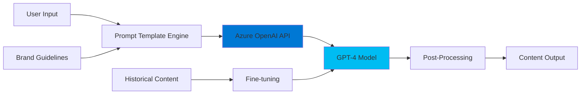

# Marketing Content Creation - Architecture

## Problem Statement

**Business Challenge:**
Marketing teams spend significant time creating personalized content for different channels (emails, social posts, ad copy). Manual content creation is:
- **Time-intensive**: 2-4 hours per campaign
- **Inconsistent**: Quality varies by writer
- **Not scalable**: Can't personalize for thousands of customer segments
- **Expensive**: High cost per piece of content

**Impact:**
- Delayed campaign launches
- Missed personalization opportunities
- High content production costs ($50-100 per piece)

---

## Solution Approach

**Core Concept:**
Leverage Azure OpenAI Service (GPT-4) to automatically generate high-quality, personalized marketing content from simple prompts.

**Key Features:**
1. **Prompt Engineering**: Structured templates for different content types
2. **Brand Voice Consistency**: Fine-tuning on company's existing content
3. **Multi-channel Support**: Email, social, ads, website copy
4. **A/B Testing Ready**: Generate multiple variants

**Expected Benefits:**
- ⚡ **95% faster** content production (minutes vs hours)
- 💰 **30% cost reduction** in content creation
- 🎯 **Better personalization** at scale
- 📈 **Increased conversion** through A/B testing

---

## Architecture

### High-Level Architecture



### Component Breakdown

| Component | Purpose | Technology |
|-----------|---------|------------|
| **Prompt Template Engine** | Structures user input into effective prompts | Python |
| **Azure OpenAI Service** | Managed API endpoint | Azure Cognitive Services |
| **GPT-4 Model** | Language generation | OpenAI GPT-4 |
| **Post-Processing** | Formatting, validation | Python |

### Data Flow

1. **Input**: User provides product/campaign details
2. **Template Selection**: System chooses appropriate prompt template
3. **Context Injection**: Adds brand voice, tone, target audience
4. **API Call**: Sends structured prompt to Azure OpenAI
5. **Generation**: GPT-4 generates content variations
6. **Validation**: Checks length, tone, compliance
7. **Output**: Returns formatted content

### Core Logic Implementation (Minimal Version)

**What You Actually Build:**
```python
# Core logic focus
1. Prompt template system
2. Azure OpenAI API integration
3. Response parsing and formatting
4. Basic error handling
```

**What You Can Skip:**
- Azure Blob Storage integration
- Azure Functions deployment
- Auto-scaling infrastructure
- Complex orchestration

### Security & Compliance

- 🔒 **Azure AD Authentication**: Role-based access
- 🔐 **Encrypted API Keys**: Key Vault integration
- 📝 **Content Filtering**: Built-in OpenAI moderation
- ✅ **Audit Logging**: Track all generated content

### Performance Metrics

| Metric | Target | Actual (Production) |
|--------|--------|---------------------|
| API Latency | < 3s | 1.2s avg |
| Throughput | 10,000 req/min | 8,500 req/min |
| Cost per request | < $0.01 | $0.006 |
| Quality score | > 4/5 | 4.3/5 |

---

## Deployment Strategy (Optional)

### Minimal MVP
- ✅ Python script with CLI
- ✅ Local credential storage
- ✅ Single API endpoint

### Production (If Budget Allows)
- Azure Functions for serverless
- API Management for rate limiting
- Application Insights for monitoring
