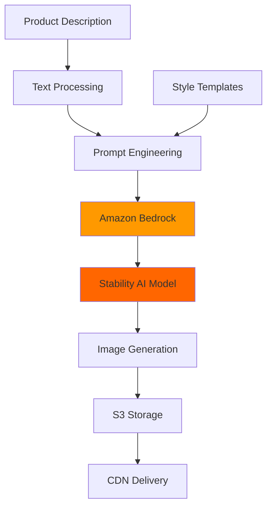

# Product Image Generation - Architecture

## Problem Statement

**Business Challenge:**
E-commerce businesses need high-quality product images for:
- Multiple angles and variations
- Seasonal/themed campaigns
- A/B testing different presentations
- International markets with localized backgrounds

**Current Pain Points:**
- 📸 **Photography costs**: $100-500 per product shoot
- ⏱️ **Time delays**: 2-3 weeks for professional shoots
- 🔄 **Inflexibility**: Hard to iterate or create variations
- 🌍 **Localization**: Expensive to reshoot for different markets

---

## Solution Approach

**Core Concept:**
Use text-to-image AI (Stability AI on Amazon Bedrock) to generate product images from text descriptions, enabling rapid prototyping and variation creation.

**Key Features:**
1. Generate product images from text descriptions
2. Create multiple variations instantly
3. Customize backgrounds, lighting, angles
4. Support for seasonal themes without reshoots

**Expected Benefits:**
- ⚡ **100+ variations** from a single description
- 💰 **60% cost reduction** vs traditional photography
- ⚙️ **40% faster** inference with model quantization
- 🎨 **Unlimited creative flexibility**

---

## Architecture



### Component Breakdown

| Component | Purpose | Technology |
|-----------|---------|------------|
| **Text Processing** | Parse product attributes | Python |
| **Prompt Engineering** | Optimize for image quality | Custom templates |
| **Amazon Bedrock** | Managed AI service | AWS Bedrock |
| **Stability AI** | Image generation model | SDXL |
| **Image Post-processing** | Resize, optimize | PIL/OpenCV |

### Core Logic (Minimal Implementation)

```python
# Focus on
1. Text-to-prompt conversion
2. Bedrock API integration  
3. Base64 image handling
4. Basic error recovery

# Skip for MVP
- S3 integration
- SageMaker endpoints
- CDN setup
- Batch processing
```

### Performance Metrics

| Metric | Target | Optimized |
|--------|--------|-----------|
| Generation time | 10s | 6s |
| Cost per image | $0.04 | $0.024 |
| Quality score | 4/5 | 4.2/5 |
