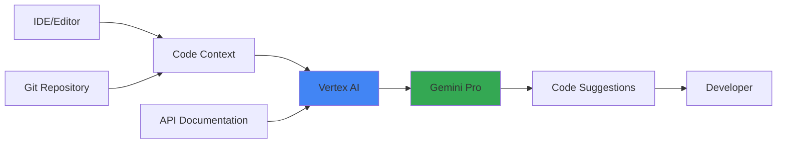

# Developer Code Completion - Architecture

## Problem Statement

**Business Challenge:**
Development teams face productivity bottlenecks:
- ⌨️ **Repetitive boilerplate** code slows developers
- 🐛 **Common bugs** from manual coding
- 📚 **API learning curves** reduce velocity
- 🔍 **Code review** takes 20-30% of dev time

**Quantified Impact:**
- Developers spend 35% time on repetitive tasks
- 2-3 hours/week looking up documentation
- Code review delays PRs by 1-2 days

---

## Solution Approach

**Core Concept:**
Real-time AI code suggestions using Google's Gemini Code Assist, integrated directly into developer workflows.

**Key Features:**
1. Context-aware code completion
2. Function/class generation from comments
3. Bug detection and fixes
4. API usage examples

**Expected Benefits:**
- ⚡ **25% faster** development velocity
- 🎯 **Better accuracy** through prompt chaining
- 🚀 **Auto-scaling** for 1,000+ developers
- 📖 **Reduced documentation** lookups

---

## Architecture



### Component Breakdown

| Component | Purpose | Technology |
|-----------|---------|------------|
| **Code Context Analyzer** | Extract relevant code snippets | Python AST |
| **Vertex AI API** | Managed inference | Google Cloud |
| **Gemini Pro** | Code generation model | Google AI |
| **Response Parser** | Format suggestions | Python |

### Core Logic (Minimal Implementation)

```python
# Build this
1. Context extraction from code files
2. Gemini API integration
3. Prompt optimization for code
4. Response formatting

# Skip for MVP  
- Cloud Run deployment
- Git integration
- Multi-file context
- Real-time streaming
```

### Performance Metrics

| Metric | Target |
|--------|--------|
| Suggestion latency | < 2s |
| Acceptance rate | > 30% |
| Cost per suggestion | $0.002 |
