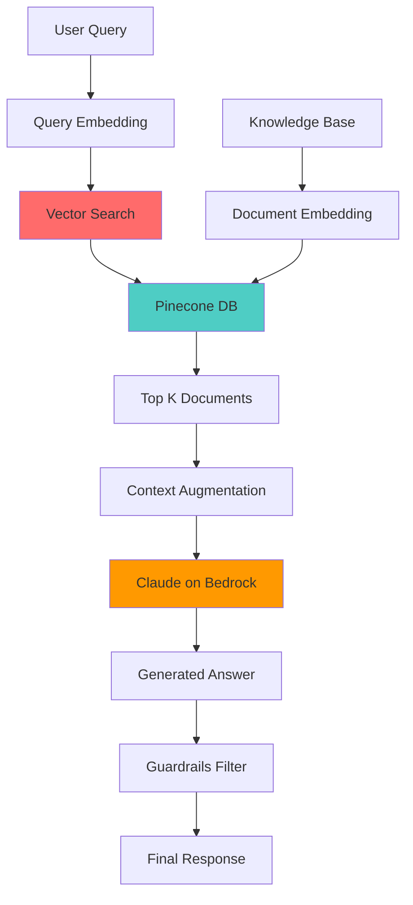
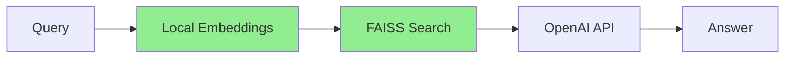

# Customer Support Knowledge Base Q&A - Architecture

## Problem Statement

**Business Challenge:**
Customer support teams struggle with:
- 📞 **High ticket volume**: 50,000+ queries/day
- 🔍 **Knowledge fragmentation**: Info across 100+ docs
- ⏱️ **Slow response times**: 4-6 hours average
- 💰 **Support costs**: $25/ticket average

**Impact:**
- 60% of queries are repetitive
- Support agents spend 40% time searching knowledge base
- Customer satisfaction declining due to wait times

---

## Solution Approach

**Core Concept:**
RAG (Retrieval-Augmented Generation) system that combines vector search with LLM generation to provide accurate, context-aware answers.

**Architecture Pattern:**
1. **Retrieve**: Find relevant documents using embeddings
2. **Augment**: Add context to user query
3. **Generate**: LLM creates natural answer

**Expected Benefits:**
- ⚡ **50% faster** response times (2-3 hours → 30 min)
- 💰 **35% cost savings** through caching
- 🎯 **90%+ accuracy** with guardrails
- 📈 **50,000 queries/day** capacity

---

## Architecture



### Component Breakdown

| Component | Purpose | Technology |
|-----------|---------|------------|
| **Embedding Service** | Convert text to vectors | OpenAI Ada |
| **Vector Database** | Similarity search | Pinecone |
| **Retrieval Engine** | Fetch relevant docs | Python |
| **LLM Generation** | Answer synthesis | Claude 2 |
| **Guardrails** | Content filtering | AWS Bedrock |

### Core Logic (Minimal Implementation)

**For Limited Resources - Local RAG:**

```python
# Simplified local implementation
1. Use sentence-transformers for embeddings (free)
2. FAISS for vector search (local, free)
3. GPT-3.5-turbo for generation (cheap)
4. Simple keyword filtering (no complex guardrails)

# Skip for MVP
- Pinecone subscription ($70/mo)
- Aurora PostgreSQL
- Bedrock Agents
- Production infrastructure
```

**Alternative Architecture for MVP:**


### Sample Implementation

```python
# Local RAG without expensive services
from sentence_transformers import SentenceTransformer
import faiss
import openai

# 1. Embed knowledge base (one-time)
model = SentenceTransformer('all-MiniLM-L6-v2')
embeddings = model.encode(knowledge_docs)
index = faiss.IndexFlatL2(embeddings.shape[1])
index.add(embeddings)

# 2. Query
query_embedding = model.encode([user_query])
distances, indices = index.search(query_embedding, k=3)

# 3. Generate
context = "\n".join([docs[i] for i in indices[0]])
response = openai.ChatCompletion.create(
    model="gpt-3.5-turbo",
    messages=[
        {"role": "system", "content": f"Answer using: {context}"},
        {"role": "user", "content": user_query}
    ]
)
```

### Performance Metrics

| Metric | Enterprise Target | MVP Target |
|--------|-------------------|------------|
| Response time | < 5s | < 10s |
| Accuracy | 90% | 75% |
| Cost/query | $0.01 | $0.003 |
| Daily queries | 50,000 | 1,000 |
