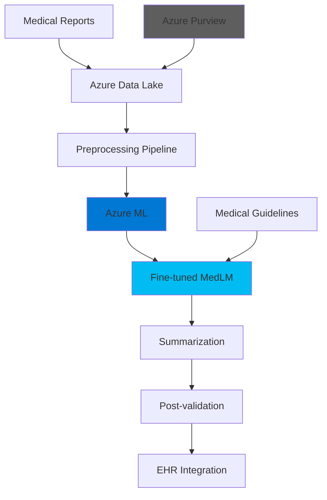

# Healthcare Report Summarization - Architecture

## Problem Statement

**Business Challenge:**
Healthcare providers face documentation overload:
- 📄 **Report volume**: 100-200 reports/day per hospital
- ⏱️ **Reading time**: 15-30 min per report
- 🏥 **Physician burnout**: 40% due to admin work
- ⚖️ **Compliance**: HIPAA requires detailed documentation

**Impact:**
- Doctors spend 2+ hours/day on documentation
- Delayed diagnoses due to information overload
- $4.6B annual cost from inefficiency

---

## Solution Approach

**Core Concept:**
Fine-tuned medical LLM (MedLM) on Azure ML to generate concise, accurate summaries while maintaining HIPAA compliance.

**Key Features:**
1. Domain-specific summarization (radiology, pathology, clinical notes)
2. HIPAA-compliant processing
3. Batch inference for cost efficiency
4. Medical terminology preservation

**Expected Benefits:**
- ⚡ **80% time savings** (30 min → 6 min per report)
- 🎯 **Clinical accuracy** maintained
- 🔒 **HIPAA compliance** via Azure Purview
- 📊 **Batch processing** for high volume

---

## Architecture



### Component Breakdown

| Component | Purpose | Technology |
|-----------|---------|------------|
| **Data Ingestion** | Secure report upload | Azure Data Lake |
| **Preprocessing** | Anonymization, cleaning | Python + Presidio |
| **Model Service** | Summarization inference | Azure ML |
| **Validation** | Medical accuracy checks | Rules engine |
| **Compliance** | HIPAA audit trail | Azure Purview |

### Core Logic (Minimal Implementation)

```python
# Focus on core summarization
1. Text preprocessing (anonymization)
2. API call to medical LLM
3. Summary formatting
4. Basic validation rules

# Skip for MVP
- Azure ML Pipelines
- AKS deployment
- Azure Data Lake
- Full HIPAA infra
- Fine-tuning (use base model)
```

**Simplified Approach:**
```python
# Use GPT-4 with medical prompt instead of MedLM
from openai import OpenAI

def summarize_medical_report(report_text):
    client = OpenAI()
    response = client.chat.completions.create(
        model="gpt-4",
        messages=[
            {"role": "system", "content": 
             "You are a medical AI. Summarize reports accurately, "
             "preserving key findings, diagnoses, and recommendations."},
            {"role": "user", "content": report_text}
        ]
    )
    return response.choices[0].message.content
```

### Security & Compliance

| Requirement | Implementation |
|-------------|----------------|
| **HIPAA** | Data encryption, access logs |
| **PHI Handling** | Auto-redaction with Presidio |
| **Audit Trail** | All operations logged |
| **Access Control** | Role-based (doctors only) |

### Performance Metrics

| Metric | Target | MVP |
|--------|--------|-----|
| Summarization time | < 30s | < 60s |
| Accuracy | 95% | 85% |
| Cost per report | $0.05 | $0.02 |
