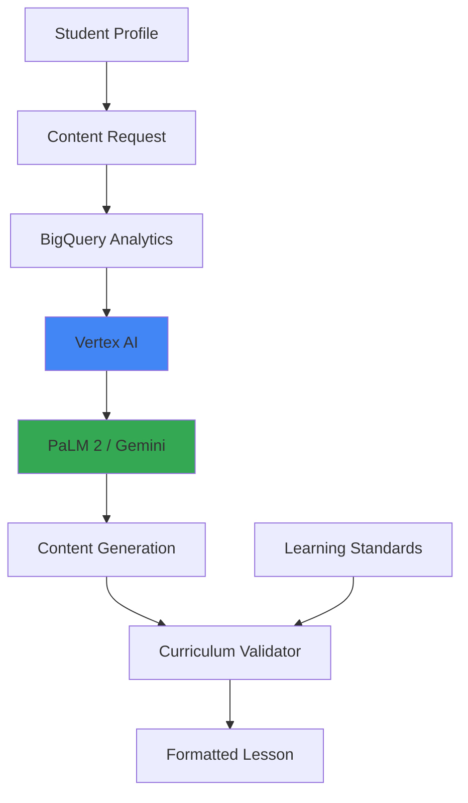

# Personalized Learning Content Generator - Architecture

## Problem Statement

**Business Challenge:**
Educational institutions struggle with:
- 👥 **Diverse learning styles**: One-size-fits-all doesn't work
- 📚 **Content creation burden**: Teachers spend 10+ hrs/week on materials
- 🎯 **Personalization gap**: Can't tailor to individual student levels
- 💰 **Resource constraints**: Limited budget for custom content

**Impact:**
- 30% of students fall behind due to poor content fit
- Teachers overwhelmed by prep time
- Low engagement in standardized materials

---

## Solution Approach

**Core Concept:**
Generate personalized educational content (lesson plans, exercises, explanations) using Vertex AI, adapting to student level, learning style, and subject matter.

**Key Features:**
1. Multi-level content (beginner → advanced)
2. Different formats (visual, text, interactive)
3. Curriculum-aligned materials
4. Instant adaptation based on student progress

**Expected Benefits:**
- ⚡ **70% faster** content creation
- 🎯 **Improved engagement** through personalization
- 📈 **Better outcomes** with adaptive materials
- 🏫 **School-wide deployment** via Cloud Run

---

## Architecture



### Core Logic (Minimal Implementation)

```python
# MVP Focus
1. Student level detection
2. Topic-based prompt templates
3. Gemini API for generation
4. Simple validation rules

# Skip for MVP
- BigQuery integration
- Cloud Run deployment
- Student progress tracking
- A/B testing infrastructure
```

### Performance Metrics

| Metric | Target |
|--------|--------|
| Generation time | < 5s |
| Content quality | 4.5/5 |
| Personalization accuracy | 80% |
