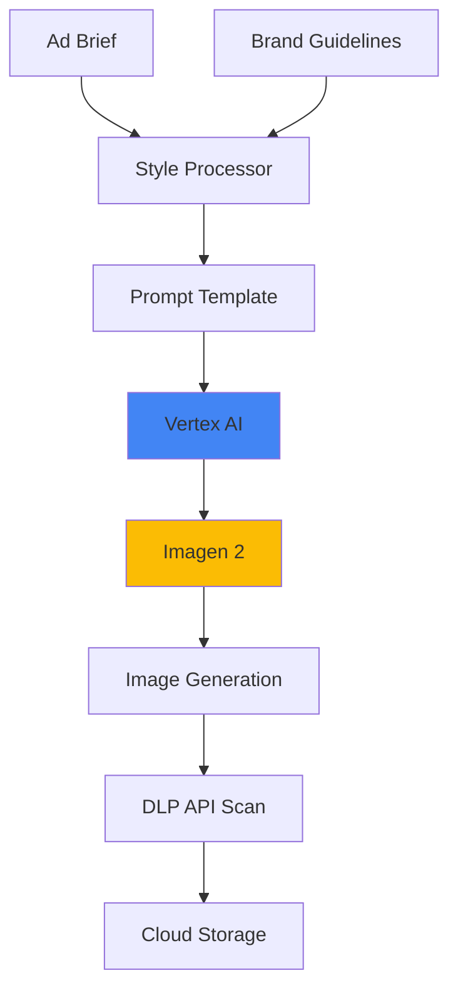

# Creative Ad Design Tool - Architecture

## Problem Statement

**Business Challenge:**
Marketing agencies face:
- 🎨 **Design costs**: $200-500 per ad creative
- ⏱️ **Slow iteration**: 3-5 days for design cycles
- 🔄 **A/B testing limitations**: Expensive to create variants
- 🌐 **Scale issues**: Can't personalize for micro-segments

**Impact:**
- Limited creative testing reduces ROI
- High cost per creative limits campaigns
- Slow turnaround misses opportunities

---

## Solution Approach

**Core Concept:**
Text-to-image generation using Google's Imagen on Vertex AI to create professional ad creatives from text descriptions.

**Key Features:**
1. Text-driven ad generation
2. Brand style consistency
3. Batch generation for variants
4. Multi-format output (social, display, print)

**Expected Benefits:**
- ⚡ **10x faster** creative production
- 💰 **Cost savings** with preemptible VMs
- 🎯 **Unlimited variants** for testing
- 🖼️ **Professional quality** output

---

## Architecture



### Core Logic (Minimal Implementation)

```python
# MVP Focus
1. Prompt engineering for ads
2. Imagen API integration
3. Image download/save
4. Basic quality checks

# Skip for MVP
- TPU optimization
- Cloud Functions orchestration
- DLP API (content scanning)
- Batch processing pipelines
```

### Performance Metrics

| Metric | Target |
|--------|--------|
| Generation time | < 15s |
| Cost per image | $0.05 |
| Quality acceptance | 75% |
