# Automated Code Review System - Architecture

## Problem Statement

**Business Challenge:**
Software teams face code review bottlenecks:
- ⏱️ **Review delays**: 1-2 days to get feedback
- 🔍 **Inconsistent quality**: Varies by reviewer
- 💰 **Resource intensive**: 20-30% of senior dev time
- 🐛 **Bugs slip through**: Human reviewers miss patterns

**Impact:**
- Delayed deployments
- Technical debt accumulation
- Junior developers get less feedback
- Productivity losses from context switching

---

## Solution Approach

**Core Concept:**
AI-powered code review using Amazon Q Developer / CodeWhisperer on SageMaker to provide instant, consistent feedback on pull requests.

**Key Features:**
1. Automated style and quality checks
2. Security vulnerability detection
3. Best practice suggestions
4. Performance optimization hints

**Expected Benefits:**
- ⚡ **Instant feedback** vs 1-2 day wait
- 🎯 **Consistent standards** across team
- 💰 **50% reduction** in review time
- 🔒 **Security improvements** with spot instances

---

## Architecture

```mermaid
graph TB
    A[PR Created] --> B[CodeCommit Webhook]
    B --> C[Lambda Trigger]
    C --> D[Code Extraction]
    D --> E[SageMaker Endpoint]
    E --> F[Amazon Q / CodeWhisperer]
    F --> G[Review Analysis]
    G --> H[Comment Generation]
    H --> I[Post to PR]
    
    J[Code Standards] --> F
    
    style E fill:#FF9900
    style F fill:#232F3E
```



### Core Logic (Minimal Implementation)

```python
# MVP Focus
1. Code parsing and analysis
2. LLM-based review (GPT-4 or Claude)
3. Comment formatting
4. Simple rule-based checks

# Skip for MVP
- CodeCommit integration
- Lambda triggers
- SageMaker deployment
- Webhook automation
```

**Simplified Approach:**
```python
# Local code review with OpenAI
import ast

def review_code(code):
    # Parse syntax
    try:
        tree = ast.parse(code)
    except SyntaxError as e:
        return f"Syntax error: {e}"
    
    # LLM review
    response = openai.chat.completions.create(
        model="gpt-4",
        messages=[{
            "role": "system",
            "content": "You are a code reviewer. "
                      "Review for bugs, style, performance."
        }, {
            "role": "user",
            "content": code
        }]
    )
    return response.choices[0].message.content
```

### Performance Metrics

| Metric | Target |
|--------|--------|
| Review time | < 2 min |
| False positives | < 10% |
| Cost per review | $0.05 |
