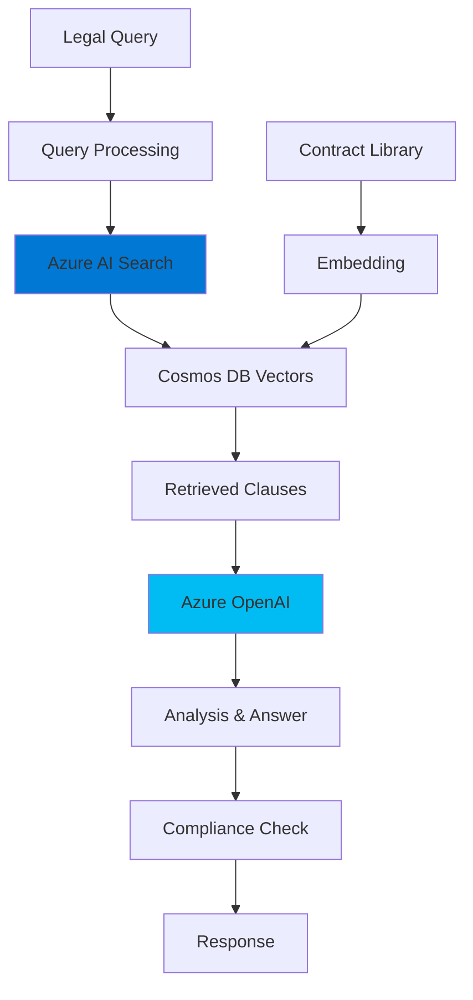

# Legal Document Analysis - Architecture

## Problem Statement

**Business Challenge:**
Legal teams face document review challenges:
- 📄 **Volume**: 1,000s of contracts to review
- ⏱️ **Time intensive**: 2-4 hours per contract
- 💰 **High costs**: $300-500/hour for legal review
- 🔍 **Risk**: Missing critical clauses

**Impact:**
- Deal delays due to review backlog
- $200K+ annual costs for routine review
- Risk exposure from missed clauses
- Junior lawyers on repetitive tasks

---

## Solution Approach

**Core Concept:**
RAG-based contract analysis using Azure AI Search + OpenAI to quickly find and explain relevant clauses, reducing manual review time.

**Key Features:**
1. Semantic search across contract library
2. Clause extraction and comparison
3. Risk flagging (unusual terms)
4. Natural language Q&A

**Expected Benefits:**
- ⚡ **70% faster** initial review
- 🎯 **Comprehensive coverage** via AI search
- 💰 **60% cost reduction** for routine contracts
- 🔒 **RBAC security** for sensitive docs

---

## Architecture



### Core Logic (Minimal Implementation - Local RAG)

```python
# MVP without Azure services
1. Use sentence-transformers for embeddings
2. ChromaDB for local vector storage
3. OpenAI GPT-4 for analysis
4. Keyword-based compliance rules

# Skip for MVP
- Azure AI Search ($100+/mo)
- Cosmos DB
- Azure Functions
- RBAC infrastructure
```

**Simplified Implementation:**
```python
from sentence_transformers import SentenceTransformer
import chromadb

# Setup
model = SentenceTransformer('all-MiniLM-L6-v2')
client = chromadb.Client()
collection = client.create_collection("contracts")

# Index contracts
for doc in contract_library:
    embedding = model.encode(doc['text'])
    collection.add(
        embeddings=[embedding],
        documents=[doc['text']],
        ids=[doc['id']]
    )

# Query
def analyze_contract(query):
    query_emb = model.encode(query)
    results = collection.query(
        query_embeddings=[query_emb],
        n_results=3
    )
    
    # Send to LLM
    context = "\n".join(results['documents'][0])
    response = openai.chat.completions.create(
        model="gpt-4",
        messages=[{
            "role": "system",
            "content": f"Analyze contract clauses:\n{context}"
        }, {
            "role": "user",
            "content": query
        }]
    )
    return response.choices[0].message.content
```

### Performance Metrics

| Metric | Enterprise | MVP |
|--------|------------|-----|
| Search time | < 2s | < 5s |
| Analysis time | < 10s | < 30s |
| Accuracy | 90% | 75% |
| Cost/query | $0.02 | $0.005 |
