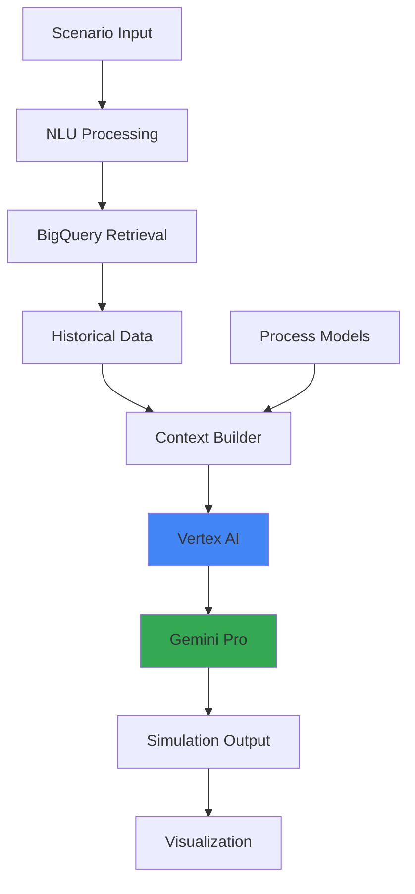

# Operational Simulation for Manufacturing - Architecture

## Problem Statement

**Business Challenge:**
Manufacturing operations face planning challenges:
- 🏭 **Complex systems**: 100+ interdependent processes
- 📊 **What-if scenarios**: Hard to predict impact of changes
- ⏱️ **Slow planning**: Weeks to model scenarios manually
- 💰 **Costly mistakes**: $100K+ from poor decisions

**Impact:**
- Reactive instead of proactive planning
- Missed optimization opportunities
- Risk from untested operational changes
- Limited scenario exploration

---

## Solution Approach

**Core Concept:**
RAG-powered simulation system using Vertex AI + operational data from BigQuery to simulate manufacturing scenarios and predict outcomes.

**Key Features:**
1. Historical data analysis from BigQuery
2. Natural language scenario definition
3. Impact prediction across metrics
4. Recommendation generation

**Expected Benefits:**
- ⚡ **Real-time** scenario analysis
- 🎯 **Data-driven** decision making
- 💰 **Risk reduction** through simulation
- 📈 **Optimization insights** from AI

---

## Architecture



### Core Logic (Minimal Implementation)

```python
# MVP Focus (No BigQuery needed)
1. CSV/JSON data loading
2. Simple scenario parsing
3. Gemini API for analysis
4. Basic metrics calculation

# Skip for MVP
- BigQuery integration
- GKE deployment
- Artifact Registry
- Complex data pipelines
```

**Simplified Approach:**
```python
import pandas as pd
from vertexai.generative_models import GenerativeModel

# Load historical data
ops_data = pd.read_csv('manufacturing_data.csv')

def simulate_scenario(scenario):
    # Get relevant historical data
    context = ops_data.describe().to_string()
    
    # Build prompt
    prompt = f"""
    Manufacturing Data Summary:
    {context}
    
    Scenario: {scenario}
    
    Analyze the potential impact on:
    1. Production volume
    2. Quality metrics
    3. Cost implications
    4. Timeline effects
    """
    
    # Generate simulation
    model = GenerativeModel("gemini-1.5-pro")
    response = model.generate_content(prompt)
    
    return response.text

# Example
result = simulate_scenario(
    "20% delay in raw material delivery"
)
print(result)
```

### Performance Metrics

| Metric | Enterprise | MVP |
|--------|------------|-----|
| Simulation time | < 30s | < 60s |
| Accuracy | 85% | 70% |
| Scenarios/day | 1,000s | 100s |
| Cost/simulation | $0.10 | $0.02 |

### Use Case Examples

1. **Supply Chain Disruption**
   - "What if supplier A delays by 2 weeks?"
   
2. **Capacity Planning**
   - "Impact of adding 20% production capacity?"
   
3. **Quality Issues**
   - "If defect rate increases to 5%, what happens?"
   
4. **Cost Optimization**
   - "Switch to cheaper material B - trade-offs?"
